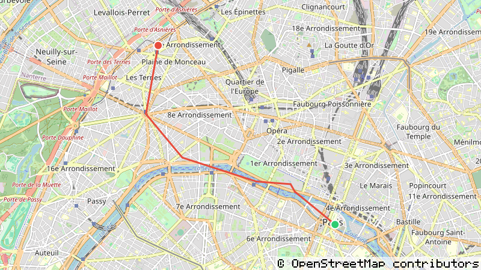

# gpxsnap

A dependency-free route-preview PNG renderer for Bun. GPX tracks (or plain
coordinates) in, a static map image out — no native bindings anywhere in the
chain: no `sharp`, no `libvips`, just `fetch` and the Web `CompressionStream`
/ `DecompressionStream` APIs.



## Install

```bash
bun add gpxsnap
```

## Usage

```ts
import { renderRoute } from "gpxsnap";

const png = await renderRoute({
  coordinates: [
    [2.3522, 48.8566],
    [2.295, 48.8738],
    [2.2986, 48.8867],
  ], // [lon, lat][]
  width: 1200,
  height: 600,
  padding: 40,
});

await Bun.write("route.png", png);
```

See `examples/basic.ts` for a runnable example (`bun examples/basic.ts`).

For an actual `.gpx` file, use the `gpxsnap/gpx` convenience entry point
instead of extracting coordinates yourself:

```ts
import { renderGpx } from "gpxsnap/gpx";

const gpxContents = await Bun.file("route.gpx").text();
const png = await renderGpx(gpxContents, { width: 1200, height: 600 });
```

It extracts every `<trkpt>` in the file (flattening across multiple
`<trkseg>`/`<trk>` elements) and renders them the same way `renderRoute`
would. See `examples/gpx.ts` for a runnable example (`bun examples/gpx.ts`).

## API

### `renderRoute(options): Promise<Uint8Array>`

| Option        | Type                      | Default                                          | Notes                                                      |
| ------------- | ------------------------- | ------------------------------------------------ | ---------------------------------------------------------- |
| `coordinates` | `[number, number][]`      | required                                         | `[lon, lat]` pairs                                         |
| `width`       | `number`                  | required                                         | output PNG width in pixels                                 |
| `height`      | `number`                  | required                                         | output PNG height in pixels                                |
| `padding`     | `number`                  | `40`                                             | margin kept between the fitted route bbox and canvas edge  |
| `line`        | `LineStyle`               | see below                                        | route stroke styling                                       |
| `markers`     | `boolean \| MarkersStyle` | `true`                                           | start/end pins; `false` to omit                            |
| `tileUrl`     | `string`                  | `https://tile.openstreetmap.org/{z}/{x}/{y}.png` | any `{z}`/`{x}`/`{y}` XYZ template                         |
| `attribution` | `boolean \| string`       | `true` (OSM text)                                | pass a string for a non-OSM tile source's required wording |
| `concurrency` | `number`                  | `8`                                              | max simultaneous tile fetches                              |
| `userAgent`   | `string`                  | `gpxsnap (https://github.com/Slashgear/gpxsnap)` | sent on every tile request                                 |
| `fetchImpl`   | `FetchLike`               | global `fetch`                                   | injection point for tests / custom networking              |

### `LineStyle` (the `line` option)

| Field     | Type     | Default     |
| --------- | -------- | ----------- |
| `color`   | `string` | `"#E74C3C"` |
| `width`   | `number` | `3`         |
| `opacity` | `number` | `1`         |

### `MarkersStyle` (the `markers` option, as `{ start?, end? }`)

Each of `start` / `end` is a `MarkerStyle`:

| Field       | Type     | Default                             |
| ----------- | -------- | ----------------------------------- |
| `radius`    | `number` | `6`                                 |
| `color`     | `string` | `"#2ECC71"` start / `"#E74C3C"` end |
| `ringColor` | `string` | `"#ffffff"`                         |
| `ringWidth` | `number` | `2`                                 |
| `opacity`   | `number` | `1`                                 |

### `renderGpx(gpxContents, options): Promise<Uint8Array>`

Same options as `renderRoute`, minus `coordinates` (extracted from the GPX
data for you). Exported from `gpxsnap/gpx`.

## Why

[`staticmaps`](https://www.npmjs.com/package/staticmaps) works, but it pulls
in a native `sharp`/`libvips` binary plus a transitive `modern-async` →
`core-js-pure` chain of ES5 polyfills, just to stitch some tiles and draw a
line. None of that is essential — tile fetch, PNG decode/encode, and line
rasterization are small, boundable, well-documented pieces of code, built here
using only Web-standard APIs that Bun (and modern Node) already ship.

## Development

```bash
bun install
bun test          # run tests
bun run typecheck  # tsc --noEmit
bun run lint       # oxlint
bun run fmt:check  # oxfmt --check
```

Test fixtures in `test/fixtures/` are real tiles pulled from
`tile.openstreetmap.org`, checked in so the test suite never touches the
network.

## Roadmap

| Stage | Ships                                                 | Proves                                                     |
| ----- | ----------------------------------------------------- | ---------------------------------------------------------- |
| v0.1  | Tile math + fetch + decode + composite                | Real OSM tiles round-trip into one correct stitched image  |
| v0.2  | Polyline stroke rendering                             | The actual point of the library works end to end           |
| v0.3  | Attribution stamp, start/end markers, bbox edge cases | Safe to point at real OSM tiles in public                  |
| v0.4  | `gpxsnap/gpx` convenience parser                      | Drop-in for the common "I just have a .gpx file" case      |
| v1.0  | README with a real rendered sample, docs, npm publish | Someone besides you can install and use it in five minutes |

v0.1-v1.0 are implemented and tested; npm publish itself is a separate,
explicit step (see below).

## Legal

The default tile source, `tile.openstreetmap.org`, is volunteer-funded and
governed by a strict [usage policy](https://operations.osmfoundation.org/policies/tiles/):
a descriptive `User-Agent` is required, heavy/production automated use is not
welcome, and attribution is required on every rendered image. Set
`userAgent` to something that identifies your app, and for production use
consider self-hosting tiles or a paid provider (MapTiler, Stadia,
Thunderforest).

## License

MIT
